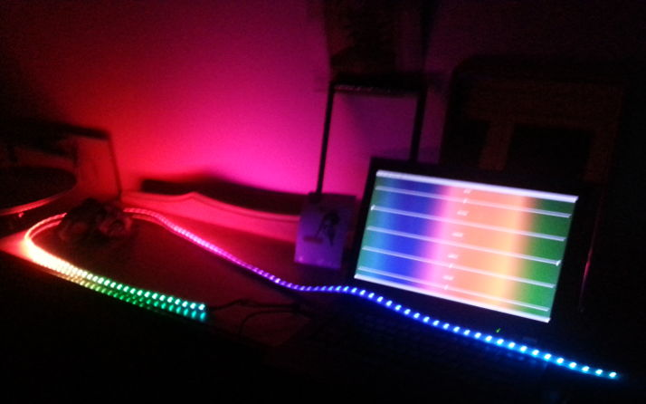

# mood-light

mood light using electron and APA102C LEDs



## install

```shell
git clone ahdinosaur/mood-light
cd mood-light
npm install
npm run rebuild
npm start
```

to run this app on boot, see [ahdinosaur/boot-to-electron](https://github.com/ahdinosaur/boot-to-electron)

### how to install as standalone device

- purchase [beaglebone green](http://www.seeedstudio.com/SeeedStudio-BeagleBone-Green-p-2504.html)
- purchase [7 inch touch display for beaglebone](http://www.seeedstudio.com/7-Inch-LCD-Cape-for-Beagle-Bone-Black-Touch-Display-p-1697.html)
- download and flash [latest beaglebone image](http://beagleboard.org/latest-images)
- install `node` and `npm` using [`nvm`](https://github.com/creationix/nvm)
- as `root` user: update, upgrade, and install system dependencies

```shell
apt-get update
apt-get upgrade -y
apt-get install -y git vim curl wget zip # dev
apt-get install -y make gcc g++ # build
apt-get install -y ntp ntpdate # time
apt-get install -y xinit # x11
apt-get install -y libnotify4 gconf2 libnss3 # electron
```

- as `root` user, clean up unnecessary programs

```shell
apt-get autoremove -y lximage-qt liblxqt0 lightdm lxqt-* lxde*
apt-get autoremove -y nodejs bb-bonescript-installer-beta bb-doc-bone101-jekyll bb-node-red-installer bb-npm-installer bb-node-red-installer
apt-get autoremove -y apache2* doc-beaglebone-getting-started doc-beaglebonegreen-getting-started doc-seeed-bbgw-getting-started
```

- as `root` user, set time (use your own timezone instead of `Pacific/Auckland`)

```shell
mv /etc/localtime /etc/localtime.old
ln -s /usr/share/zoneinfo/Pacific/Auckland /etc/localtime
pkill ntpd
ntpdate pool.ntp.org
systemctl start ntp.service
```

- as `root` user, setup `nodm` display manager to run `debian` user's `.xinitrc`.

```shell
apt-get install -y nodm
sed -i "s/NODM_ENABLED=false/NODM_ENABLED=true/" /etc/default/nodm
sed -i "s/NODM_USER=root/NODM_USER=debian/" /etc/default/nodm
sed -i "s/NODM_XSESSION=\/etc\/X11\/Xsession/NODM_XSESSION=\/home\/debian\/.xinitrc/" /etc/default/nodm
```

- as `debian` user, install `mood-light`

```shell
git clone git://github.com/ahdinosaur/mood-light $HOME/mood-light
cd $HOME/mood-light
npm install
```

- as `debian` user, setup `.xinitrc` to run `mood-light` on boot

```shell
echo "exec $HOME/mood-light/.bin/electron $HOME/mood-light" > $HOME/.xinitrc
chmod +x $HOME/.xinitrc
```


## license

The Apache License

Copyright &copy; 2016 Michael Williams

Licensed under the Apache License, Version 2.0 (the "License");
you may not use this file except in compliance with the License.
You may obtain a copy of the License at

    http://www.apache.org/licenses/LICENSE-2.0

Unless required by applicable law or agreed to in writing, software
distributed under the License is distributed on an "AS IS" BASIS,
WITHOUT WARRANTIES OR CONDITIONS OF ANY KIND, either express or implied.
See the License for the specific language governing permissions and
limitations under the License.
